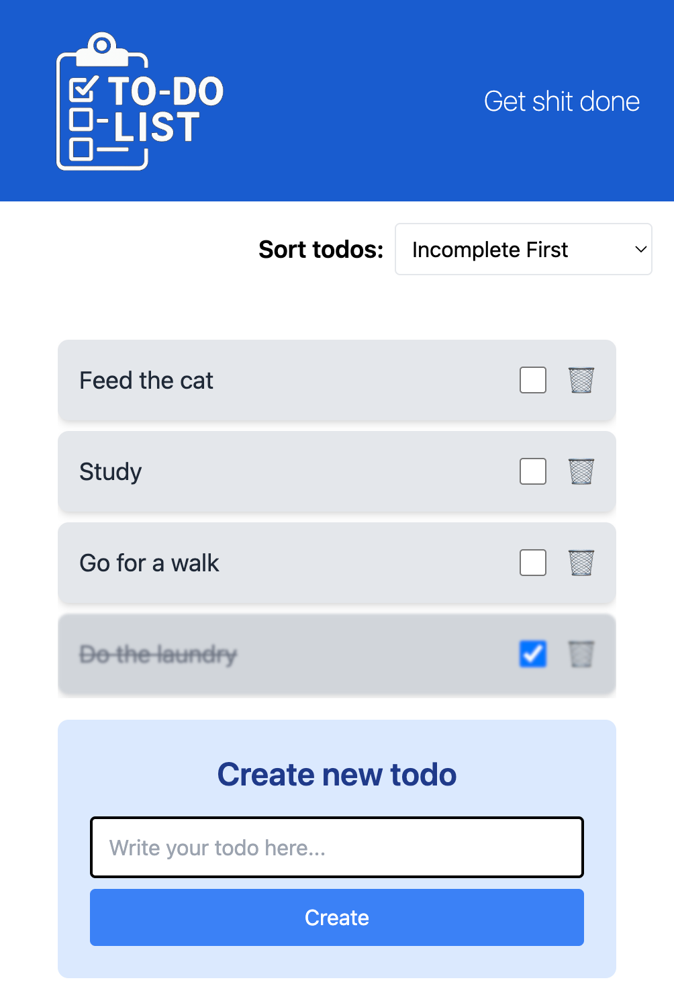

# School Project - Javascript Frameworks - Todos

## 📝 Project Description
 This project was an assignment in the course Javascript Frameworks where the goal was to build a fully functional todo list using React and TypeScript. 

 The app allows users to keep track of tasks they need to complete.
 It displays a list of todos, lets users add new ones, mark them as complete or incomplete, and sort them based on different criteria. 

---

## 🔗 Demo 

Check out the live version here: 
👉 [https://medieinstitutet.github.io/fed24d-the-last-todos-Biehlen/](https://medieinstitutet.github.io/fed24d-the-last-todos-Biehlen/)

---

## 🖼️ Screenshot 

---

## ⚙️ Tech Stack

---

## 🎯 Assignment Requirements 

✅ Basic (Grade G)

- Display a hardcoded list of todo items on screen.
- Mark a todo as completed and reflect the change both visually and in the JavaScript state.
- Use localStorage so that the list persists between sessions.
- Use at least one component and manage state using a list of objects.

⭐ Advanced (Grade VG)

- All of the above, plus:
- Allow toggling todos between completed and uncompleted.
- Add a form to create new todos dynamically.
- Implement sorting (e.g. by completion status or alphabetical order).
- Use a CSS framework such as Tailwind CSS or Material UI.
- Use at least three components.
- Apply the "Lifting State Up" principle to manage shared state properly.

---

## 😄 Author
Created by: 
- [Anna Biehl](https://github.com/biehlen)

---

## 🤝 Credits
This project was developed as part of the curriculum at [Medieinstitutet](https://medieinstitutet.se/) during our first year of studies.